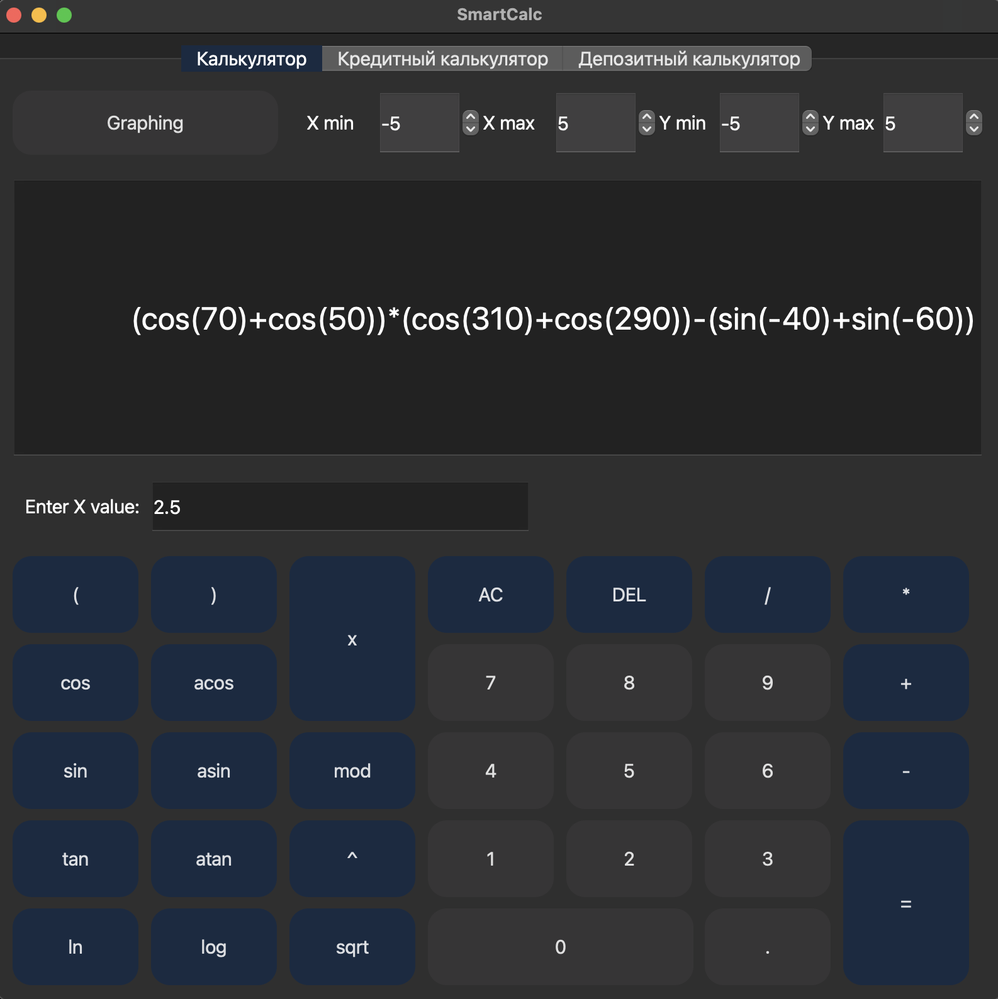
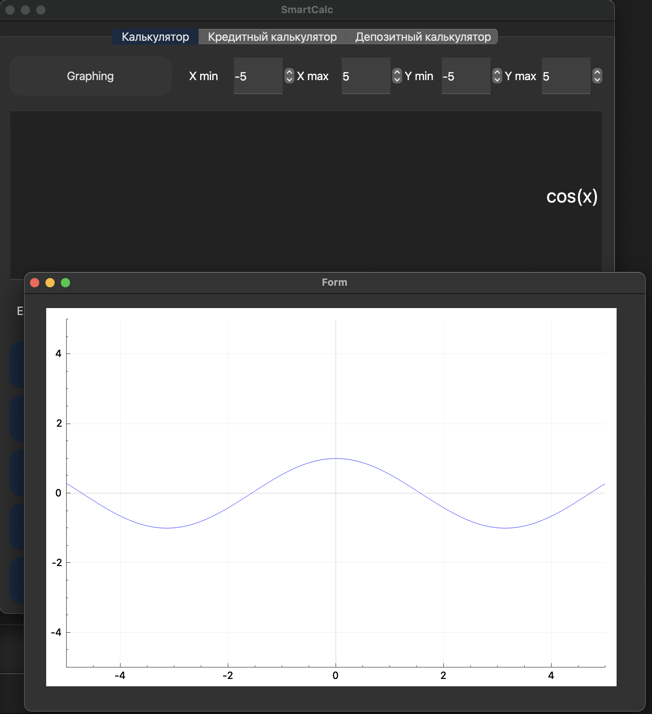

Учебный проект на основном обучении в Школе 21 - реализация на языке программирования Си с использованием структурного подхода расширенной версии обычного калькулятора.

## Информация
Программа разработана на языке Си стандарта C11 с использованием компилятора gcc. Графический интерфейс реализован с использованием дополнительных библиотек и модулей QT.
Сборка программы осуществляется с помощью Makefile.
Обеспечено покрытие unit-тестами модулей, связанных с вычислением выражений, с помощью библиотеки Check.

Поддерживаются следующие арифметические операции и математические функции:
   - **Арифметические операторы**:

        | Название оператора | Инфиксная нотация   (Классическая) | Префиксная нотация   (Польская нотация) |  Постфиксная нотация   (Обратная польская нотация) |
        | ------ | ------ | ------ | ------ |
        | Скобки | (a + b) | (+ a b) | a b + |
        | Сложение | a + b | + a b | a b + |
        | Вычитание | a - b | - a b | a b - |
        | Умножение | a * b | * a b | a b * |
        | Деление | a / b | / a b | a b \ |
        | Возведение в степень | a ^ b | ^ a b | a b ^ |
        | Остаток от деления | a mod b | mod a b | a b mod |
        | Унарный плюс | +a | +a | a+ |
        | Унарный минус | -a | -a | a- |

        - **Функции**:

        | Описание функции | Функция |
        | ---------------- | ------- |
        | Вычисляет косинус | cos(x) |
        | Вычисляет синус | sin(x) |
        | Вычисляет тангенс | tan(x) |
        | Вычисляет арккосинус | acos(x) |
        | Вычисляет арксинус | asin(x) |
        | Вычисляет арктангенс | atan(x) |
        | Вычисляет квадратный корень | sqrt(x) |
        | Вычисляет натуральный логарифм | ln(x) |
        | Вычисляет десятичный логарифм | log(x) |

## Кредитный калькулятор

Предусмотрен специальный режим "кредитный калькулятор":
- Вход: общая сумма кредита, срок, процентная ставка, тип (аннуитетный, дифференцированный)
- Выход: ежемесячный платеж, переплата по кредиту, общая выплата

## Депозитный калькулятор

Предусмотрен специальный режим "калькулятор доходности вкладов":
- Вход: сумма вклада, срок размещения, процентная ставка, налоговая ставка, периодичность выплат, капитализация процентов, список пополнений, список частичных снятий
- Выход: начисленные проценты, сумма налога, сумма на вкладе к концу срока
